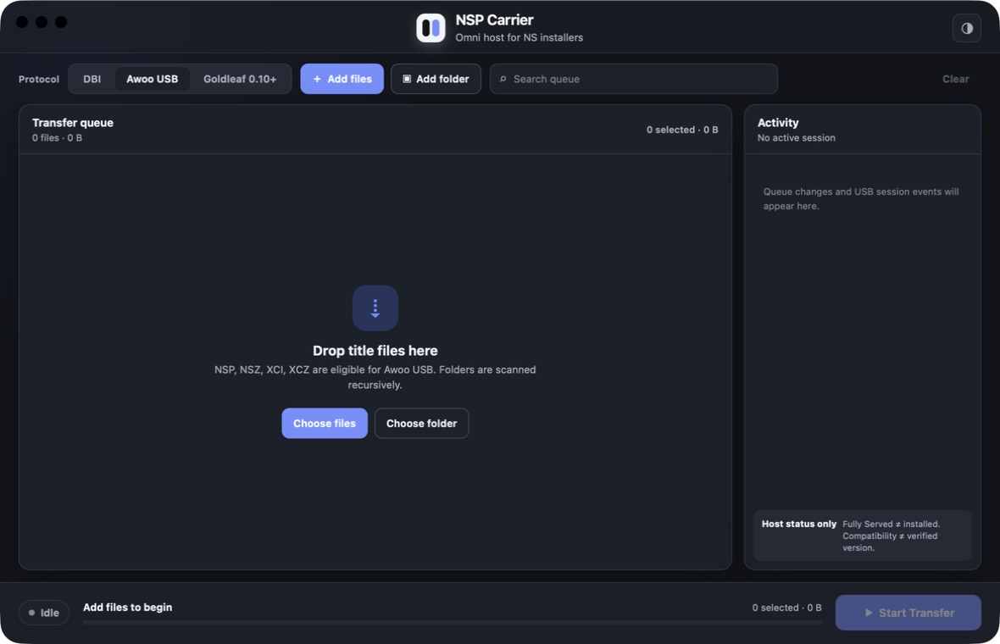
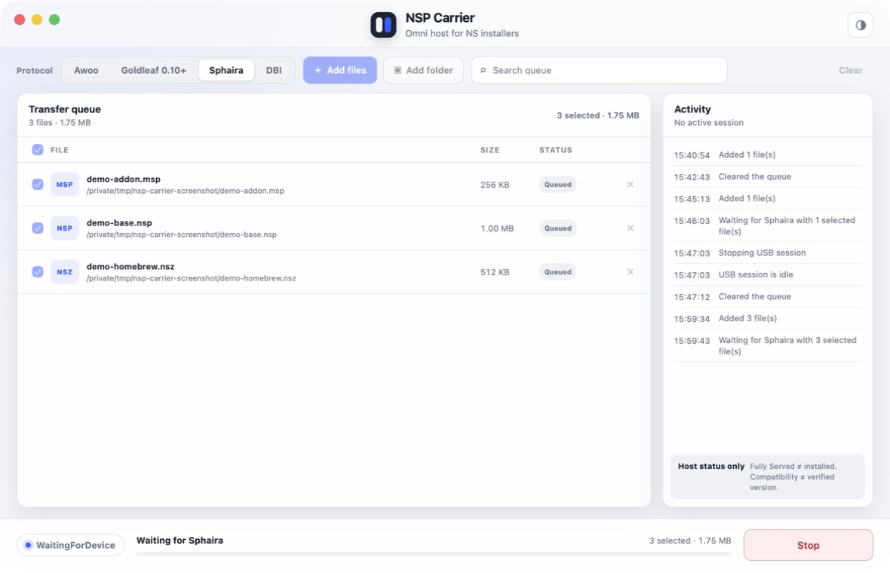

<p align="center">
  
  <br />
  <strong style="font-size: 32px">NSP Carrier</strong>
</p>

简体中文 · [English](README.md)

`nsp-carrier` 是一个面向 NS 安装器的 Go 宿主（host），带有基于 Wails v2 + Svelte/TypeScript 的桌面 UI。它通过用户显式选择的 DBI、Awoo 或 Goldleaf profile 暴露选定的本地文件。

宿主只报告其能够观测到的 USB 会话与文件服务状态。它既不是 MTP 实现，也不是 Switch 端安装器，更不能证明某个 title 已成功安装。



具有代表性的队列与传输进度状态：



## 功能

- 通过显式选择的安装器 profile（DBI、Awoo 或 Goldleaf 0.10+）经 USB 提供文件服务。
- 文件与递归文件夹选择，支持拖放。
- 队列支持搜索与重复文件名校验。
- 逐文件唯一字节进度、有界活动日志与类型化错误。
- 开始/停止，宿主持有会话生命周期——重新连接会开启全新会话，绝不声称恢复传输。
- 自动/浅色/深色外观。

宿主只报告其能够观测到的内容：`FullyServed`（已完整服务）表示安装器请求的每个字节都已发送，并不表示 title 已安装。

## 快速开始

`nsp-carrier` 是一款桌面应用。它通过 USB 把你选定的文件提供给 Switch 上运行的安装器；它绝不会写入 Switch，因此安装始终在安装器一侧进行。

你需要：

- 一台在 USB 模式下运行匹配安装器的 Switch —— DBI、Awoo Installer 1.6.2 或 Goldleaf 0.10+；
- 一根连接 PC 与 Switch 的 USB 线；
- 一份应用副本。目前还没有公开安装包，暂时需要从源码构建（见[开发](#开发)）或使用 CI 构建产物。

基本流程：

1. 向队列添加 `.nsp`、`.nsz`、`.xci` 或 `.xcz` 文件与文件夹（也支持拖放）。
2. 选择与你的安装器匹配的 profile：DBI、Awoo 或 Goldleaf。
3. 开始服务，然后在 Switch 的安装器中安装。
4. 在应用中查看逐文件进度。`FullyServed`（已完整服务）表示宿主已发送安装器请求的每一个字节——并不表示 title 已安装。

所选 profile 无法服务的文件会以明确的校验错误阻止 Start，而不会被静默跳过。

平台相关配置——macOS 的 `libusb`、Windows 的 USB 驱动——见[安装](#安装)。

## 安装

### macOS

macOS 通过 `libusb` 访问 USB。使用 Homebrew 安装：

```sh
brew install libusb
```

### Windows

Switch 以裸 USB 设备的形式暴露，Windows 需要先安装兼容的 USB 驱动，`nsp-carrier` 才能看到它。使用 [Zadig](https://zadig.akeo.ie/) 安装：

1. 从 <https://zadig.akeo.ie/> 下载并运行 Zadig。
2. 用 USB 线把 Switch 连接到 PC。
3. 让安装器进入 USB 模式——DBI 进入其 USB 模式（DBIbackend）；Awoo 选择“通过 USB 安装”；Goldleaf 打开 Remote PC 浏览器。
4. 在 Zadig 中打开 *Options → List All Devices*，让 Switch 显示出来。
5. 从下拉列表选择 Switch 设备——厂商 ID 为 `057E`（Nintendo），常见显示为 `DBI`、`USB composite device` 或 `057E:3000`；选择匹配的那一项。
6. 目标驱动选择 **libusbK**（若不可用也可选 *WinUSB*）。
7. 点击 *Replace Driver*（或 *Install Driver*），等待安装完成。
8. 启动 `nsp-carrier`，确认应用能看到设备后再开始服务。

## 开发

以下内容面向从源码构建或测试 `nsp-carrier` 的人；最终用户无需关心。

### 构建前置条件

在 macOS 上安装 CGO 与前端依赖：

```sh
brew install libusb pkgconf
make deps
make ui-install
```

`make check` 运行 Go 与前端测试、竞态检查、fuzz 冒烟测试、静态分析以及本地构建。

### 开发者 USB CLI

使用本地内容路径构建并运行保留的诊断 CLI：

```sh
make build
make usb-spike ARGS='--profile=dbi --timeout=30m --verbose -- /path/to/file.nsp /path/to/folder'
make usb-spike ARGS='--profile=awoo --timeout=30m --verbose -- /path/to/file.nsp'
make usb-spike ARGS='--profile=goldleaf --timeout=30m --verbose -- /path/to/file.nsp'
```

如需有界的 Awoo 或 Goldleaf 命令元数据，请添加 `--trace-protocol`。每个会话最多发出 300 条记录，之后报告截断。记录仅包含命令、方向、结果、来源 ID 与范围元数据；绝不包含本地路径、线上名称或内容载荷。

`make gate0-probe` 是 DBI 专属：它先构建再等待，声明发现的批量端点（bulk endpoints），然后退出而不提供文件内容服务。就绪后在 Switch 上打开 `Install title from DBIbackend`。使用普通 `--profile=awoo` 流程获取 [Awoo 证据](docs/awoo-gate.md)，或使用 `--profile=goldleaf` 配合 Goldleaf 的 Remote PC 浏览器获取 [Goldleaf gate](docs/goldleaf-gate.md)。

CLI 会递归构建并冻结 catalog，等待 USB 设备 `057e:3000`，发现恰好一对批量 IN/OUT 端点，并服务所选 profile，直到其退出、断开或取消。使用 `--json` 获取换行分隔的结构化日志。真实内容文件被 Git 忽略，绝不可提交。

通过自动化测试或编译此 CLI 并不等于通过真实设备 gate；每个 profile 的验收文档仍各自具有权威性。

### 桌面应用

安装固定的 Wails v2 CLI 并验证本地 macOS 工具链：

```sh
make wails-install
make wails-doctor
```

运行或构建应用：

```sh
make app-dev
make app-build
```

产物写入 `build/bin/NSP Carrier.app`。本地 bundle 未签名；公开签名、公证与安装器仍待办。Bundle 标识符为 `im.theo.nsp-carrier`。

### 持续集成

GitHub Actions 为拉取请求、推送到 `main` 及手动运行构建并检查两个桌面目标：

- Windows amd64（原生 x64 runner）；
- macOS arm64（Apple Silicon runner）。

每个任务上传七天期的 zip 产物与 SHA-256 校验和。Windows zip 包含 `libusb-1.0.dll`；macOS 应用内嵌 `libusb`，并在打包后进行 ad-hoc 签名。这些 CI 产物未进行公开代码签名或公证。Windows 用户必须另行配置兼容的 USB 驱动（例如 WinUSB）。真实设备验收记录在 macOS arm64 上完成；不构建或支持 Linux。

### 延伸阅读

- [架构设计](docs/design.md)与[路线图](docs/roadmap.md)
- [DBI 协议说明](docs/dbi0-protocol.md)、[Awoo 协议说明](docs/awoo-usb-protocol.md)与[Goldleaf 协议说明](docs/goldleaf-usb-protocol.md)
- [DBI Gate 0](docs/gate0.md)、[Awoo gate](docs/awoo-gate.md)与[Goldleaf gate](docs/goldleaf-gate.md)

## 许可

MIT。

## 致谢

DBI、Awoo 与 Goldleaf 协议实现基于观测到的线上行为开发，以下上游项目作为行为参考：

- [`rashevskyv/dbibackend-qt`](https://github.com/rashevskyv/dbibackend-qt) —— DBI 后端参考
- [`developersu/ns-usbloader`](https://github.com/developersu/ns-usbloader) —— Awoo 与 Goldleaf 线上参考
- [`Huntereb/Awoo-Installer`](https://github.com/Huntereb/Awoo-Installer) —— Awoo 参考
- [`XorTroll/Goldleaf`](https://github.com/XorTroll/Goldleaf) —— Goldleaf 参考
